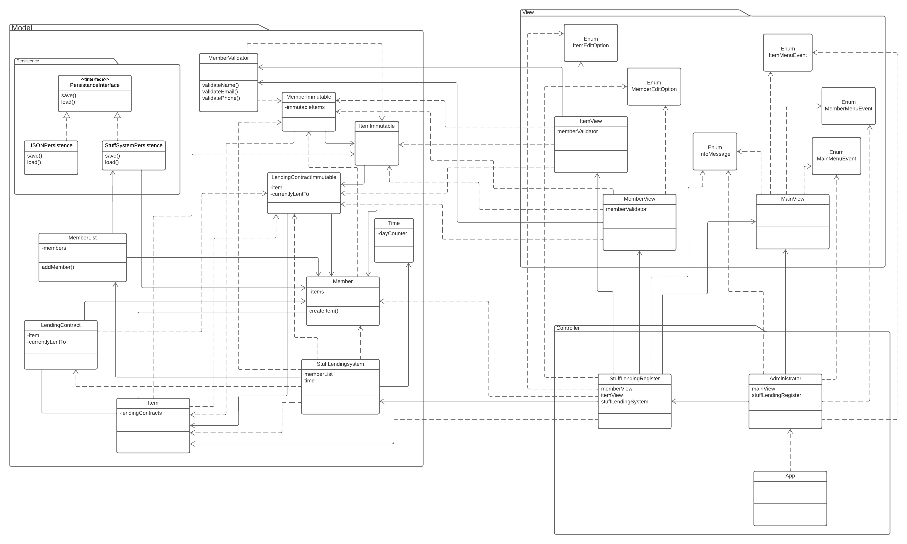
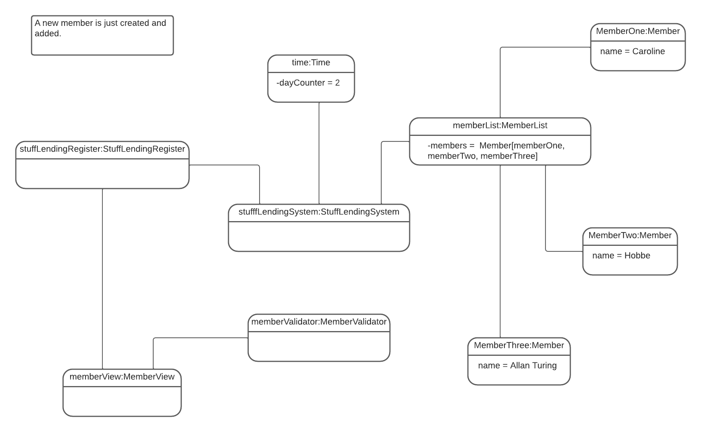
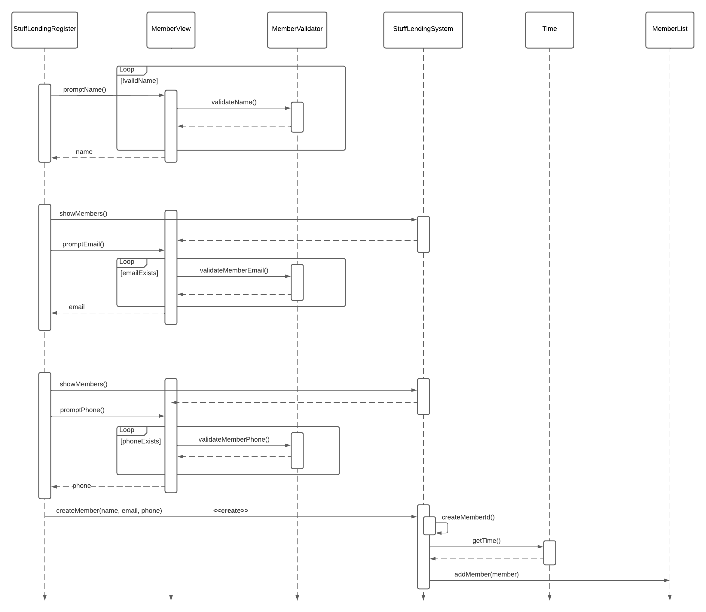

# Stuff Lending System OO-Design
This document describes the design according to the requirements presented in assignment 2.

I am seeing stuffLendingSystem as the actor organizing/processing all of the wishes a user might have. Therefor, this class WAS originally in the controller, however I realized it also held data that the view needs to read (the list of members). I then moved it to the model, and split the collecting of information from the view to another class in the controller.

I am assuming that when a certain item is wanted to be borrowed, the member trying to borrow it has "kind of been on the owning members profile page/seen member and its items in the list members option" and therefore is aware of its memberId and the name of the item it wants to borrow.

## Architectural Overview
The application uses the model-view-controller (MVC) architectural pattern. The view is passive and gets called from the controller. The view may only read information from the model, not directly change it.

## Detailed Design

### Class Diagram

### Object Diagram

### Sequence Diagram

